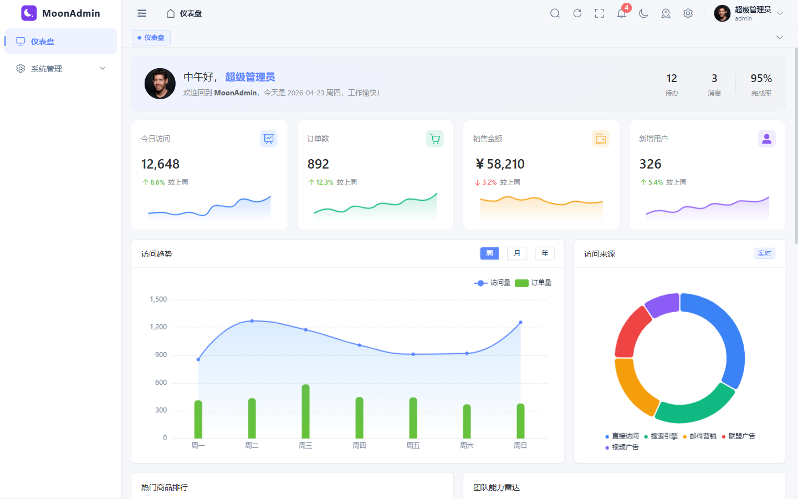
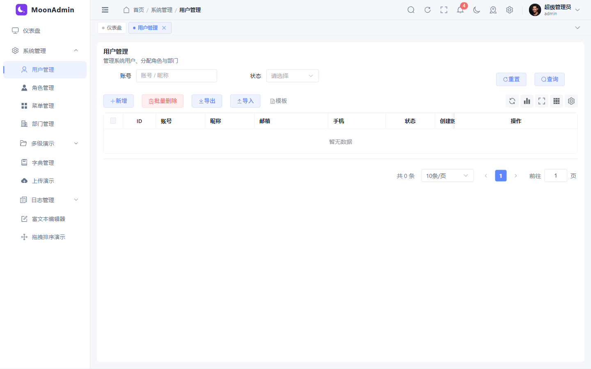
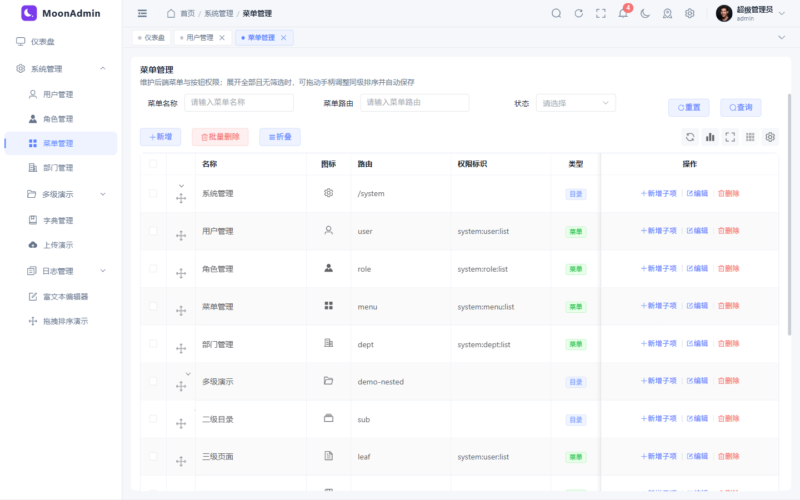

# Admin Web

> 基于 **Vue 3.5 + TypeScript + Vite 8 + Element Plus + Tailwind CSS 4** 的现代化中后台管理前端，对接 Laravel admin 后端。

一套 **轻量、可定制、TS 友好、约定优先** 的脚手架。所有列表 / 弹窗 / 权限 / 主题都遵循同一套约定，新业务模块按"模板拷贝 + 接口替换"即可上线。

---

## 界面预览

以下截图为本地开发环境（`pnpm dev`、开启 `VITE_APP_MOCK=true`）下 **1440×900** 视口效果。图片文件在仓库内 [`docs/readme/`](./docs/readme/)，**提交并推送后**，在 GitHub / Gitee 打开本 README 即可直接预览（无需外链图床）。

<p align="center"><b>登录页</b></p>
<p align="center">
  
</p>

<p align="center"><b>工作台（Dashboard）</b></p>
<p align="center">
  
</p>

<p align="center"><b>系统管理 · 用户列表</b></p>
<p align="center">
  
</p>

<p align="center"><b>系统管理 · 菜单管理（树表）</b></p>
<p align="center">
  
</p>

---

## 一、特性总览

### 1. 工程基础
- **Vue 3.5 + TypeScript + Vite 8**：`<script setup>` + Composition API + Rolldown ESM HMR，启动速度 ~3s
- **Element Plus 按需引入**：`unplugin-vue-components` 自动注册组件 / 图标
- **Tailwind CSS 4（仅 utilities）**：`tailwind.css` 只引入 theme + utilities，不启用 Preflight，避免与 Element Plus / `index.scss` 冲突；布局与组件样式仍用 SCSS；模板中可写 `flex`、`gap-2`、`mr-1` 等工具类
- **Pinia 3 + persistedstate**：`user / permission / app / tabs` 四个 Store
- **Axios 二次封装**：JWT + RefreshToken 自动续期、并发刷新合并、统一错误提示
- **多语言**：vue-i18n + Element Plus 语言包，与 `useAppStore().locale` 联动
- **暗黑模式**：CSS 变量切换；主题色一键改 → 派生 light-1~9 / dark-2 / `--el-color-primary-rgb`
- **多页签**：affix / keep-alive / 关闭其他·左侧·右侧·全部
- **生产可用**：路由守卫、错误兜底、403 / 404 / 500、Redirect、NProgress

### 2. CRUD 基础设施
- **`useCrud` 组合式**：抽象列表加载 / 分页 / 搜索 / 新增 / 编辑 / 单删 / 批量删，自动适配「分页响应」与「全量数组响应」
- **`PageWrapper` + `DataTableShell` + `SearchForm`**：列表页三件套，统一标题、工具栏、密度、列设置、刷新
- **`InlineEdit`**：行内编辑通用组件
- **`CSV 导入/导出`**（`src/utils/csv.ts`）：零依赖、UTF-8 BOM、RFC 4180 解析
- **批量删除**：全模块拉齐，`removeMany` 优先，缺失则降级为串行 `remove`
- **`v-perm` 权限指令**：按钮级权限，`v-perm="'system:user:add'"`

### 3. 通用业务组件
- **`Upload`**：单图 / 多图 / 文件三模式，含校验、业务分类、预览、上传 API + Mock
- **`RichEditor`**：基于 **WangEditor v5** 的富文本，支持图片上传（`uploadApi`）/ 源码 / 全屏
- **`Echarts`**：自动跟随主题色 + 暗色模式
- **`Notification`**：消息中心（已读 / 全部已读 / 清空）
- **`MenuSearch / Captcha / IconSelect / SvgIcon / LogoMark`**

### 4. 后台业务模块（开箱）
- **系统管理**：用户、角色（含权限分配抽屉）、菜单、部门、字典
- **日志**：操作日志、登录日志（含详情抽屉、批量删、清空）
- **个人中心**：四 tab（基本资料 / 安全设置 / 修改密码 / 消息中心）+ 头像上传 + 密码强度
- **演示页**：通用上传演示、富文本编辑器演示
- **Dashboard / 多级菜单演示**

### 5. 性能与工程化
- **路由懒加载分组**：`vite.config.ts` 用函数式 `manualChunks` 把 `node_modules` 按域分包（vue / element / echarts / vueuse / utils / iconify / vendor），把业务视图按一级目录分包（`view-system / view-profile …`）
- **ECharts 按需**：`echarts/core` + `LineChart / BarChart / PieChart / TitleComponent / TooltipComponent / GridComponent / LegendComponent / DataZoomComponent`
- **gzip 压缩**：`vite-plugin-compression` 生成 `.gz`
- **Vitest 单测**：`useCrud / csv / tree` 三个核心工具的单元测试
- **i18n 扫描脚本**：`pnpm scan:i18n` 自动盘点硬编码中文，输出 `docs/i18n-gap.md`

---

## 二、技术栈

| 类别 | 技术 |
| ---- | ---- |
| 语言 | TypeScript 6.0 |
| 框架 | Vue 3.5 |
| 构建 | Vite 8.0 |
| UI | Element Plus 2.13 |
| 原子 CSS | Tailwind CSS 4 |
| 状态管理 | Pinia 3 + pinia-plugin-persistedstate 4 |
| 路由 | Vue Router 4 |
| HTTP | Axios 1.15 + qs |
| 图表 | ECharts 6.0（按需）|
| 图标 | @iconify-json/ep + Element Plus Icons |
| 国际化 | vue-i18n 11 |
| 单测 | Vitest 4 + @vue/test-utils + jsdom |
| 工具 | @vueuse/core 14、lodash-es、dayjs、mitt、nprogress |
| 拖拽 | SortableJS 1.15 |

---

## 三、目录结构

```
admin-web/
├─ public/                  # 静态资源
├─ scripts/
│  └─ scan-i18n.mjs         # i18n 缺失扫描（pnpm scan:i18n）
├─ src/
│  ├─ api/                  # 后端 API 模块
│  │  ├─ auth.ts
│  │  ├─ profile.ts
│  │  ├─ notification.ts
│  │  ├─ common/upload.ts
│  │  └─ system/            # user / role / menu / dept / dict / log
│  ├─ assets/
│  ├─ components/           # 全局组件
│  │  ├─ PageWrapper /  SearchForm  /  DataTable
│  │  ├─ Upload     /  RichEditor   /  InlineEdit
│  │  ├─ Echarts    /  Notification /  MenuSearch
│  │  └─ Captcha    /  IconSelect   /  SvgIcon ...
│  ├─ composables/          # useCrud / useChartTheme / useMenuTitle
│  ├─ config/               # APP_CONFIG / CACHE_KEYS / RESP_CODE
│  ├─ directives/           # v-perm
│  ├─ layout/               # Sidebar / Header / Tabs / Breadcrumb / Logo / TopMenu / ColumnsRail
│  ├─ locales/              # vue-i18n（zh-CN / en-US）
│  ├─ mock/                 # 开发 Mock（VITE_APP_MOCK=true 时启用）
│  ├─ router/               # routes / dynamic / guard
│  ├─ store/modules/        # user / permission / app / tabs
│  ├─ styles/               # reset / variables / transition
│  ├─ types/                # 全局类型声明
│  ├─ utils/                # http / auth / storage / tree / csv / mitt / route / watermark
│  ├─ views/
│  │  ├─ login / dashboard / profile / error / redirect
│  │  └─ system/
│  │     ├─ user / role / menu / dept / dict
│  │     ├─ log/{operation,login}
│  │     ├─ upload-demo
│  │     └─ rich-editor-demo
│  ├─ App.vue
│  └─ main.ts
├─ tests/                   # Vitest 单测
│  ├─ utils/{csv,tree}.spec.ts
│  └─ composables/useCrud.spec.ts
├─ docs/                    # 开发说明（入口 docs/index.md）
│  ├─ list-page.md / form-dialog.md / components.md
│  ├─ theme.md   /  api.md   /  permission.md
│  └─ i18n-gap.md            # pnpm scan:i18n 自动产出
├─ vite.config.ts / vitest.config.ts
├─ tsconfig.json
└─ package.json
```

完整文档索引见 [`docs/index.md`](./docs/index.md)。

---

## 四、环境变量

| 变量 | 说明 | 示例 |
| ---- | ---- | ---- |
| `VITE_APP_TITLE` | 应用标题 | `Admin Web` |
| `VITE_APP_VERSION` | 版本号 | `0.1.0` |
| `VITE_APP_BASE_API` | 前端请求 base 路径 | `/admin` |
| `VITE_APP_PROXY_TARGET` | dev 代理目标 | `http://127.0.0.1:8787` |
| `VITE_APP_PORT` | 开发服务器端口；未配置或无效时回退 **5173**（见 `vite.config.ts`） | `8080` |
| `VITE_APP_OPEN` | dev 自动打开浏览器 | `true` |
| `VITE_APP_BUILD_SOURCEMAP` | 构建是否生成 sourcemap（`vite.config` 读 `=== 'true'`） | `false` |
| `VITE_APP_BUILD_COMPRESS` | 类型中有声明；**当前构建未读取**，生产环境由 `vite-plugin-compression` 固定生成 `.gz` | — |
| `VITE_APP_MOCK` | 为 `true` 时在入口注册 Mock | `true`（开发常用）|

---

## 五、快速开始

```bash
# 1. 安装（强烈建议在 laravel-admin workspace 根目录执行 pnpm install）
pnpm install

# 2. 启动开发
pnpm dev          # 默认 http://localhost:5173/

# 3. 单元测试
pnpm test         # 一次性跑完
pnpm test:watch   # watch 模式
pnpm test:ui      # 图形化界面

# 4. 构建 / 预览
pnpm build
pnpm preview

# 5. 工具脚本
pnpm scan:i18n    # 扫描硬编码中文，写入 docs/i18n-gap.md
```

### Windows 终端编码（重要）
**Windows 中文系统终端默认是 GBK，向源码文件重定向输出（`>` / `>>`）会把中文转成 `?`，造成永久数据丢失。**

PowerShell 推荐先切到 UTF-8：

```powershell
chcp 65001
$OutputEncoding = [System.Text.UTF8Encoding]::new($false)
[Console]::OutputEncoding = [System.Text.UTF8Encoding]::new($false)
```

- 已通过项目根 `.editorconfig` 强制 IDE 以 UTF-8 写入所有源码文件
- 切勿用 `echo "中文" > xxx.vue` 这类命令直接覆盖含中文的源码

---

## 六、核心约定

### 1. 接口约定

后端遵循 Laravel admin 接口风格，统一返回结构：

```json
{ "code": 200, "msg": "success", "data": { ... }, "time": 1700000000 }
```

业务码定义见 `src/config/index.ts` 的 `RESP_CODE`：

| code | 含义 |
| ---- | ---- |
| `200` | 成功 |
| `400` | 普通业务失败 |
| `401` | 未登录或 Session 已过期 |
| `403` | 无权限 |
| `404` | 资源不存在 |
| `422` | 参数验证失败 |
| `500` | 服务端异常 |
| `419` | CSRF Token 无效或已过期 |

详见 [`docs/api.md`](./docs/api.md)。

### 2. 路由约定

- 后端菜单 `type` 取值：`M` 目录 / `C` 页面 / `B` 按钮
- 顶层 `type: 'C'` 的页面会自动包一层 `Layout`
- `meta` 字段：`title / icon / hidden / keepAlive / affix / permission / roles / activeMenu / breadcrumb / transition / rank`

### 3. 权限约定

- 角色：`API.UserInfo.roles`（`string[]`）
- 按钮权限：`API.UserInfo.permissions`（`string[]`），模板用 `v-perm="'system:user:add'"`

### 4. 缓存键

统一在 `src/config/index.ts` 的 `CACHE_KEYS` 维护：

```ts
CACHE_KEYS.TOKEN          // 'ADMIN_SESSION'
CACHE_KEYS.USER_INFO      // 'ADMIN_USER_INFO'
CACHE_KEYS.THEME          // 'ADMIN_THEME'
CACHE_KEYS.TABS           // 'ADMIN_TABS'
CACHE_KEYS.PERMISSION     // 'ADMIN_PERMISSION'
```

---

## 七、开发指南

### 1. 新增一个业务列表页（推荐路径）

1. 在 `src/api/` 新增模块（导出 `list / detail / add / update / remove / removeMany`）
2. 在 `src/views/` 创建 `index.vue`，使用：
   ```vue
   <PageWrapper title="...">
     <DataTableShell ...>
       <template #search>
         <SearchForm :model="query" @search="onSearch" @reset="onReset">...</SearchForm>
       </template>
       <el-table :data="list" v-loading="loading" @selection-change="onSelectionChange">...</el-table>
       <template #footer>
         <el-pagination v-model:current-page="query.page" v-model:page-size="query.pageSize" :total="total" @current-change="loadData" />
       </template>
     </DataTableShell>
   </PageWrapper>
   ```
3. 直接调用 `useCrud(api, { defaultQuery, batchKey: 'id' })` 接管所有 CRUD
4. **把新页挂进侧栏菜单**（任选其一，勿照抄不存在的表名）：

   - **推荐**：登录后台在「系统管理 → 菜单管理」里新增目录与页面，字段与 [`docs/api.md` § 菜单模块](docs/api.md#五菜单模块systemmenu) 中 `MenuItem` / `POST /system/menu` 一致。
   - **或** 直接调接口 `POST /system/menu`（body 为 JSON，见同文档示例），由 Laravel admin 后端写入菜单存储（表名、字段以实际后端为准）。
   - **对接传统控制器式菜单时**：控制器动作地址不要直接当作 Vue `path` 使用；SPA 需要的 `path` / `component` 需在服务端映射或单独维护，说明见 [`docs/api.md` § 传统控制器式菜单对齐](docs/api.md#58-与传统控制器式菜单如何对齐)。

5. `permissionStore.fetchMenus()` 自动注册路由，无需重启 dev server

### 2. 调用接口

```ts
import { userApi } from '@/api/system/user';
const { list, total } = await userApi.list({ page: 1, pageSize: 20 });
```

### 3. 文件上传

```vue
<Upload v-model="formData.cover" type="image" :max-size="5" biz-type="cover" />
<Upload v-model="formData.images" type="multiple" :limit="9" />
<Upload v-model="formData.attachment" type="file" :max-size="50" />
```

详见 `src/views/system/upload-demo/index.vue`。

### 4. 富文本

```vue
<RichEditor v-model="article.content" :height="400" />
```

详见 `src/views/system/rich-editor-demo/index.vue`。

### 5. 自动导入

`vue / vue-router / pinia / @vueuse/core / vue-i18n / element-plus` 的常用 API 已自动导入；`src/components/` 下组件自动注册（见 `vite.config.ts` 中 `unplugin-auto-import` / `unplugin-vue-components`）。

---

## 八、单元测试

```bash
pnpm test
```

当前覆盖：

- `tests/utils/csv.spec.ts` — CSV 导出 / 解析（BOM、转义、空行）
- `tests/utils/tree.spec.ts` — `listToTree / treeToList / findTreeNode / filterTree`
- `tests/composables/useCrud.spec.ts` — 列表加载、分页、搜索、单删 / 批量删、`removeMany` 降级、错误兜底

`vitest.config.ts` 与 `vite.config.ts` 解耦，测试环境跳过 Tailwind / AutoImport 等运行时插件。

---

## 九、生产部署

构建后将 `dist/` 部署到任意静态服务器。Nginx 关键配置：

```nginx
location / {
    root   /var/www/admin-web/dist;
    index  index.html;
    try_files $uri $uri/ /index.html;
    # 透出 .gz（vite-plugin-compression 已生成）
    gzip_static on;
}

location /admin/ {
    proxy_pass http://127.0.0.1:8787/admin/;
    proxy_set_header Host $host;
    proxy_set_header X-Real-IP $remote_addr;
}
```

---

## 十、文档导航

| 主题 | 文档 |
| ---- | ---- |
| 入口与版本 | [`docs/index.md`](./docs/index.md) |
| 列表页开发（CRUD 全流程） | [`docs/list-page.md`](./docs/list-page.md) |
| 弹窗 / 抽屉 / 表单 / 校验 | [`docs/form-dialog.md`](./docs/form-dialog.md) |
| 通用组件 API | [`docs/components.md`](./docs/components.md) |
| 主题 / 暗黑 / 布局 | [`docs/theme.md`](./docs/theme.md) |
| 后端接口契约 | [`docs/api.md`](./docs/api.md) |
| 权限 / 路由 / 菜单 | [`docs/permission.md`](./docs/permission.md) |
| i18n 缺失清单（自动生成） | [`docs/i18n-gap.md`](./docs/i18n-gap.md) |

---

## 十一、License

[MIT](./LICENSE)
